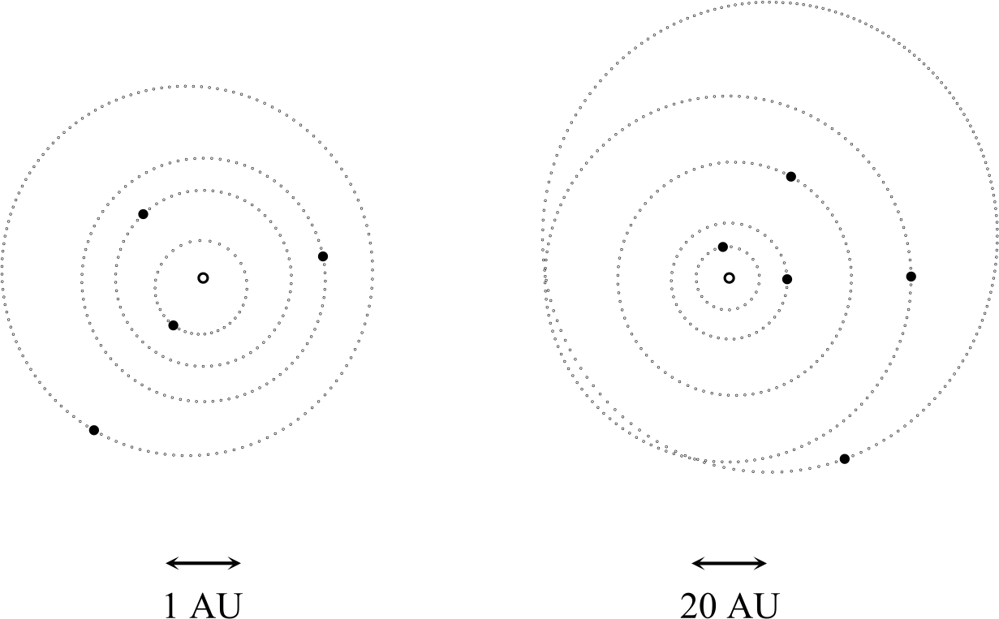

# Dynamic-Orbital-Diagrams

Dynamic planetary orbital diagrams in Word via VBA.

---

<figure style="width:616px;">
  
  <figcaption>Figure 1. The anticlockwise orbits of the Solar System's planets viewed from the J2000 north ecliptic pole at JD 2460952 (03-Oct-2025, 12 PM, UTC). The J2000 vernal equinox forms the Cartesian x-axis (horizontal, right oriented). Open circles at the centre of the diagrams represent the Sun. The small, filled circles represent planets. Left: the orbits of Mercury, Venus, the Earth-Moon barycentre and Mars, in order of increasing orbital radius. Right: the orbits of Jupiter, Saturn, Uranus, Neptune and Pluto, again in order of increasing orbital radius. Lengths are denoted in astronomical units (AU). Solar and planetary radii aren't rendered to scale.</figcaption>
</figure>

---

### Key Files

Dynamic Planetary Orbital Diagrams.docm &nbsp;&nbsp; Macro-enabled Word document.

Dynamic planetary orbital diagrams were developed for Microsoft Word. Rendering routines were built with Visual Basic for Applications (VBA), the scripting language built into Microsoft's Office suite.

<b>The VBA code is computationally intensive, so the document may be slower than typical Word documents to open.</b> Waiting a few minutes may be necessary before Word completes processing.

### Software Requirements

- Word (Windows version).

The webcam sampler has been tested with Word, version 2508, on Windows 11.

### Software Configuration

Macro-enabled content must be active in Word to render dynamic diagrams.

Additionally, Windows may block the document's macros. To resolve this, right click on the file to open Document Properties. Go to the General tab, Security section and select the Unblock check box.

### Reference

Stenborg, TN, "Dynamic Planetary Orbital Diagrams with Microsoft Word VBA", in ADASS XXXIV, ASP (in press).
